# System Architecture

## Overview

Heroku AI Finance is built as a modern AI-powered financial analysis application that leverages Claude 4 Sonnet through Heroku Inference API for intelligent stock analysis and investment insights.

## Architecture Diagram

```mermaid
graph TB
    %% User Interface Layer
    User[👤 User] --> UI[🖥️ Next.js Frontend]
    UI --> Chat[💬 Chat Interface]
    
    %% Application Layer
    Chat --> API[🔄 /api/chat Route]
    API --> Auth[🔐 NextAuth.js]
    API --> AIProvider[🤖 heroku-ai-provider]
    
    %% AI Processing Layer
    AIProvider --> HerokuAPI[☁️ Heroku Inference API]
    HerokuAPI --> Claude[🧠 Claude 4 Sonnet]
    
    %% Tools & External APIs
    Claude --> Tools[🛠️ Financial Tools Manager]
    Tools --> FinancialAPI[📊 Financial Datasets API]
    Tools --> AlphaAPI[📈 Alpha Vantage API]
    
    %% Data Storage
    API --> DB[(🗄️ PostgreSQL Database)]
    DB --> ChatHistory[💾 Chat History]
    DB --> UserData[👥 User Sessions]
    
    %% External Services
    FinancialAPI --> StockData[📋 Stock Prices & Financials]
    AlphaAPI --> Technical[📊 Technical Indicators]
    
    %% Response Flow
    Technical --> Tools
    StockData --> Tools
    Tools --> Claude
    Claude --> HerokuAPI
    HerokuAPI --> AIProvider
    AIProvider --> API
    API --> UI
    UI --> User
    
    %% Styling
    classDef userLayer fill:#e1f5fe
    classDef appLayer fill:#f3e5f5
    classDef aiLayer fill:#e8f5e8
    classDef dataLayer fill:#fff3e0
    classDef externalLayer fill:#fce4ec
    
    class User,UI,Chat userLayer
    class API,Auth,AIProvider appLayer
    class HerokuAPI,Claude,Tools aiLayer
    class DB,ChatHistory,UserData dataLayer
    class FinancialAPI,AlphaAPI,StockData,Technical externalLayer
```



## Component Details

### Frontend Layer
- **Next.js 15.0.3** - React framework with App Router
- **Streaming UI** - Real-time chat interface with tool execution feedback
- **Authentication** - NextAuth.js integration for user management

### AI Processing Layer
- **heroku-ai-provider** - Critical compatibility layer bridging Vercel AI SDK with Heroku Inference API
- **Heroku Inference API** - Cost-effective Claude 4 Sonnet access
- **Vercel AI SDK** - Streaming, tool calling, and UI integration

### Financial Tools System
- **8 Integrated Tools:**
  - `getStockPrices` - Current and historical stock data
  - `getIncomeStatements` - Company income statements
  - `getBalanceSheets` - Balance sheet analysis
  - `getCashFlowStatements` - Cash flow data
  - `getFinancialMetrics` - P/E ratios, debt metrics, ROE
  - `searchStocksByFilters` - Stock screening by financial criteria
  - `getNews` - Company news and events
  - `getTechnicalIndicators` - RSI, MACD, SMA, EMA analysis

### Data Flow Architecture

```mermaid
sequenceDiagram
    participant User
    participant NextJS as Next.js Frontend
    participant ChatAPI as /api/chat
    participant Provider as heroku-ai-provider  
    participant Heroku as Heroku Inference API
    participant Claude as Claude 4 Sonnet
    participant Tools as Financial Tools
    participant FinAPI as Financial APIs
    
    User->>NextJS: "Analyze Apple stock"
    NextJS->>ChatAPI: POST /api/chat
    ChatAPI->>Provider: streamText() with tools
    Provider->>Heroku: Transform to Heroku format
    Heroku->>Claude: Process with tool calling
    Claude->>Tools: Execute getStockPrices("AAPL")
    Tools->>FinAPI: Fetch financial data
    FinAPI-->>Tools: Return stock data
    Tools-->>Claude->>Heroku: Tool result
    Heroku-->>Provider: Streaming response
    Provider-->>ChatAPI: AI SDK compatible stream
    ChatAPI-->>NextJS: Server-sent events
    NextJS-->>User: Real-time analysis
```

## Key Integration Points

### heroku-ai-provider Bridge
- **Problem Solved**: Vercel AI SDK designed for OpenAI format, Heroku API has different structure
- **Solution**: Translates tool calls, handles streaming, manages responses
- **Critical for**: Tool calling functionality with Claude on Heroku

### Financial Data Pipeline
- **Primary Data**: Financial Datasets API (stock prices, financials, news)
- **Technical Analysis**: Alpha Vantage API (RSI, MACD, indicators)
- **Processing**: Real-time analysis with Claude's reasoning
- **Caching**: Tool call deduplication to prevent API overuse

### Security Architecture
- **Environment Variables**: All API keys stored securely
- **No Hardcoded Secrets**: Zero credentials in source code
- **Production Ready**: Heroku config vars for deployment

## Deployment Architecture

```mermaid
graph LR
    Dev[👨‍💻 Developer] --> Git[📁 Git Repository]
    Git --> Heroku[☁️ Heroku Platform]
    Heroku --> App[🚀 Production App]
    
    subgraph "Heroku Services"
        App --> Postgres[(🗄️ Heroku Postgres)]
        App --> InferenceAPI[🤖 Heroku Inference API]
    end
    
    subgraph "External APIs"
        App --> FinDatasets[📊 Financial Datasets]
        App --> AlphaVantage[📈 Alpha Vantage]
    end
    
    App --> Users[👥 End Users]
```



## Technology Stack Summary

| Layer | Technology | Purpose |
|-------|------------|---------|
| **Frontend** | Next.js 15.0.3, React, TypeScript | User interface and interaction |
| **AI Integration** | Vercel AI SDK v4.0.20, heroku-ai-provider | AI model communication and streaming |
| **AI Model** | Claude 4 Sonnet via Heroku Inference API | Natural language processing and reasoning |
| **Database** | PostgreSQL with Drizzle ORM | Data persistence and chat history |
| **Authentication** | NextAuth.js | User management and sessions |
| **Financial Data** | Financial Datasets API, Alpha Vantage API | Real-time market data and technical analysis |
| **Deployment** | Heroku Platform | Production hosting and scaling |

## Performance Characteristics

- **Streaming Responses**: Real-time AI output as Claude processes
- **Tool Call Optimization**: Deduplication prevents redundant API calls  
- **Timeout Handling**: 10-15 second timeouts for external APIs
- **Error Recovery**: Graceful degradation when APIs are unavailable
- **Cost Efficiency**: Heroku Inference API more economical than direct OpenAI